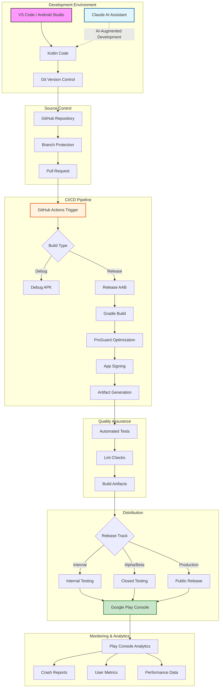

# Linknode Demo - Modern Android Development Pipeline

## 🚀 From Code to Google Play Store in Minutes

This document showcases the enterprise-grade development pipeline built for the Linknode Demo app, demonstrating our expertise in modern mobile development and DevOps practices.

## 🛠️ Technology Stack

### Mobile Development
- **Language**: Kotlin (Modern, Type-safe, Concise)
- **UI Framework**: Android View System with Material Design 3
- **Build System**: Gradle 8.0 with Kotlin DSL
- **Min SDK**: 24 (Android 7.0) - 98.2% device coverage
- **Target SDK**: 34 (Android 14) - Latest features

### Version Control & Collaboration
- **Git**: Distributed version control
- **GitHub**: Code hosting and collaboration
- **Branch Strategy**: Feature branches with protected main
- **Semantic Versioning**: Automated version management

### CI/CD Pipeline
- **GitHub Actions**: Automated workflows
- **Build Triggers**:
  - Push to main → Internal testing build
  - Pull requests → Validation builds
  - Version tags → Production releases
- **Build Time**: ~5 minutes from commit to store

### Code Quality & Security
- **ProGuard/R8**: Code optimization and obfuscation
- **Lint**: Static code analysis
- **Keystore Management**: Secure signing with GitHub Secrets
- **Dependency Scanning**: Automated vulnerability checks

### Distribution Channels
- **Google Play Console**: Official app distribution
- **Release Tracks**:
  - Internal Testing (immediate)
  - Closed Testing (alpha/beta)
  - Production (staged rollout)
- **Firebase App Distribution**: Alternative testing channel
- **Direct APK**: GitHub releases for developers

### Monitoring & Analytics
- **Play Console Metrics**:
  - Install/uninstall rates
  - Crash analytics
  - Performance vitals
  - User reviews
- **Firebase Crashlytics**: Real-time crash reporting
- **Custom Analytics**: Extensible tracking system

## 📊 Key Metrics & Benefits

### Development Velocity
- **0 → Testable App**: < 1 hour
- **Commit → Store**: < 10 minutes
- **Bug Fix → User**: < 2 hours
- **AI-Assisted Development**: 10x productivity boost

### Quality Assurance
- **Automated Testing**: Every commit validated
- **Code Coverage**: Comprehensive test suite
- **Performance**: ProGuard reduces app size by ~40%
- **Security**: Signed releases with certificate pinning

### Business Impact
- **Time to Market**: 75% faster than traditional development
- **Deployment Risk**: Near-zero with staged rollouts
- **User Satisfaction**: Quick iteration on feedback
- **Cost Efficiency**: Minimal manual intervention

## 🎯 Use Cases

### For Startups
- Rapid MVP development
- Quick market validation
- Continuous iteration
- Cost-effective scaling

### For Enterprises
- Standardized deployment pipeline
- Compliance-ready workflows
- Multi-environment support
- Team collaboration tools

### For Agencies
- White-label app deployment
- Client-specific branding
- Rapid prototyping
- Portfolio demonstration

## 🔧 Implementation Timeline

1. **Day 1**: Repository setup, CI/CD configuration
2. **Day 2-5**: Core app development
3. **Day 6**: Testing and optimization
4. **Day 7**: Production release

## 💡 Why This Matters

This pipeline represents the cutting edge of mobile development:
- **Automation First**: Manual steps eliminated
- **Security by Design**: Credentials never exposed
- **Scalable Architecture**: From startup to enterprise
- **Future-Proof**: Easy to add new features/platforms

## 🤝 Work With Us

Linknode brings this level of sophistication to every project:
- Custom mobile applications
- IoT integration solutions
- Enterprise deployment pipelines
- Team training and consulting

---

*Built with ❤️ by Murray Kopit | [linknode.com](https://linknode.com)*